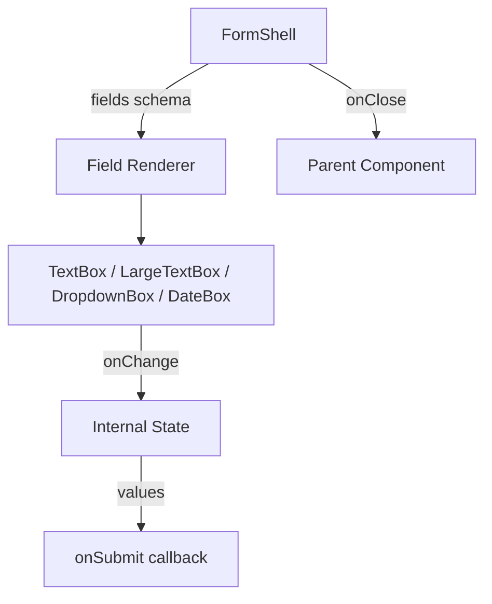

# Design: FormShell Component Architecture

## Overview
FormShell is a compound component system for rendering modal forms from a declarative schema.

## Context
The Admin panel requires frequent form creation for various entities (Users, Clients, Projects, Tasks). Currently, creating forms involves repetitive JSX, state management, and styling, leading to inconsistency and slower development. **FormShell** aims to solve this by providing a unified, schema-driven form builder.

## Goals
* **Consistency**: Ensure all forms look and behave identically (modals, validation, accessibility).
* **Speed**: Allow developers to create new forms by defining a JSON schema rather than writing component code.
* **Maintainability**: Centralize form logic (validation, submission) in one place.

## Non-Goals
*   Replacing all complex, multi-step wizards or highly custom UI flows that don't fit the standard modal pattern.

## Decisions
*   **Schema-Driven Approach**: We chose JSON-like schemas for flexibility and ease of configuration over component composition for simple forms.
*   **React DatePicker**: Selected `react-datepicker` for its maturity and RTL support over building a custom date picker from scratch.
*   **CSS Objects**: Using CSS Modules/Variables for styling to maintain separation of concerns and theming support.

## Risks & Trade-offs
*   **Flexibility vs. Simplicity**: Schema approaches can become restrictive if complex custom layouts are needed. We mitigate this by allowing custom field types but sticking to a standard vertical layout.
*   **Performance**: Large forms might re-render frequently. We rely on React's diffing and careful state management in `FormShell`.

## Migration Plan
1.  Implement `FormShell` core components (`admin/src/components/FormShell`).
2.  Refactor existing mock forms (e.g., `EmployeesManagmentPage`) to use `FormShell`.
3.  Document the new pattern in `admin/src/components/forms/README.md`.

## Open Questions
*   Should we support multi-column layouts in the future? (Currently out of scope).

## Component Hierarchy

```
FormShell (container)
├── FormHeader
│   ├── CloseFormButton
│   └── FormTitle (title + subtitle)
├── FormBody
│   └── [Dynamic Fields based on schema]
│       ├── TextBox
│       ├── LargeTextBox
│       ├── DropdownBox
│       └── DateBox
└── FormFooter
    └── PrimaryActionButton
```

## Data Flow



## Schema Design

```typescript
type FormFieldType = 'textBox' | 'largeTextBox' | 'dropdownBox' | 'dateBox' | 'dateRangeBox';

interface FieldDependency {
  fieldId: string;           // The field this depends on
  values: string[];          // Show when parent has one of these values
}

interface FormFieldSchema {
  id: string;
  type: FormFieldType;
  label: string;
  placeholder?: string;
  options?: { value: string; label: string }[];
  required?: boolean;
  maxLength?: number;
  dependsOn?: FieldDependency;   // Conditional visibility
  collapsible?: boolean;         // Can be collapsed when visible
  defaultCollapsed?: boolean;    // Start collapsed
}

interface FormShellProps {
  title: string;
  subtitle?: string;
  primaryActionLabel: string;
  onSubmit: (values: Record<string, string>) => void;
  onClose: () => void;
  fields: FormFieldSchema[];
  isSubmitting?: boolean;
}
```

## Design Decisions

### Responsive Behavior
- **Desktop-only focus**: No mobile/tablet-specific layouts
- Modal maintains fixed aspect ratio (600-720px width, proportional height)

### DateBox & DateRangeBox
- **Library**: Use `react-datepicker` for calendar UI
- **RTL Calendar**: Days displayed right-to-left, week starts on Sunday
- **Hebrew Localization**: Month names in Hebrew
- **DateRangeBox**: Single component with start/end date fields
  - Returns `{ start: string, end: string }` object
  - **Cross-field validation**: Shows error if end date < start date

### Animations
- **Collapsible sections**: Slide animation (height transition)
- **Field appearance/disappearance**: Fade + slide combination

### DropdownBox
- Single selection only (multi-select out of scope)

### Error Display
- **Field errors**: Inline below each field
- **Server errors**: Clear banner displayed above the submit button

### Modal Closing
- Close via X button in header
- Double-click outside form bounds closes modal
- Escape key closes modal

### Submission Behavior
- Submit only via button click (Enter key does NOT submit)
- During submission: All fields blocked (disabled), loading indicator shown

## Styling Strategy
- CSS variables from `global.css` for colors, spacing, shadows
- Modal uses fixed positioning with centered flexbox
- Backdrop: semi-transparent dark overlay
- Container: white background, 16-24px border-radius, 600-720px max-width
- RTL-first with `direction: rtl` inheritance

## Validation Approach
- Required fields checked on submit
- Inline error messages below each field
- General errors at form level for server responses

## File Structure
```
admin/src/components/FormShell/
├── FormShell.tsx
├── FormHeader.tsx
├── FormBody.tsx
├── FormFooter.tsx
├── fields/
│   ├── TextBox.tsx
│   ├── LargeTextBox.tsx
│   ├── DropdownBox.tsx
│   └── DateBox.tsx
├── types.ts
└── index.ts

admin/src/styles/
├── FormShell.css
└── FormFields.css
```

## Accessibility
- Modal traps focus when open
- Close on Escape key
- ARIA labels on all interactive elements
- Proper heading hierarchy (h2 for title)
