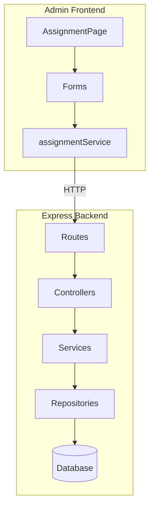
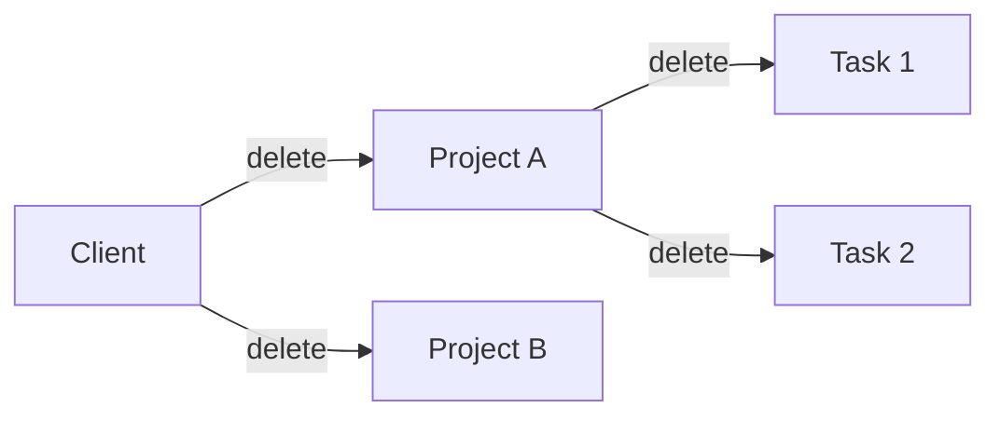

# Design — Add Assignment Entity CRUD

## Architecture Overview

This change follows the established layered architecture pattern already in use for Users CRUD:



## Key Design Decisions

### 1. Cascade Soft-Delete Strategy

When deleting entities, we use cascade soft-delete to maintain referential integrity:



**Implementation**: The service layer handles cascades, not the database. This allows for:
- Logging each cascade action
- Potential future undo functionality
- Notifications on cascade events

### 2. Dynamic Form Options

Forms require dynamic dropdown options (clients, projects, users). Two approaches considered:

| Approach | Pros | Cons |
|----------|------|------|
| **A. Pre-fetch all options on page load** | Simple, single load | Stale data if edited elsewhere |
| **B. Fetch options when form opens** | Always fresh | Slight delay on form open |

**Choice**: **Approach A** — Pre-fetch on page load and refresh after mutations. The AssignmentPage already fetches all data on mount; we'll reuse this data for form dropdowns.

### 3. Form Configuration Pattern

Current pattern uses static exports:
```typescript
export const createClientForm = { title: 'טופס...', fields: [...] };
```

**New pattern**: Factory function accepting dependencies:
```typescript
export const createClientForm = (t: TFunction) => ({
  title: t('forms.client.createTitle'),
  fields: getClientFields(t)
});
```

This enables:
- i18n at render time
- Dynamic options injection

### 4. Error Handling

Following the existing pattern in `usersService.ts`:

| Error Type | HTTP Status | Code |
|------------|-------------|------|
| Validation Error | 400 | `VALIDATION_ERROR` |
| Not Found | 404 | `CLIENT_NOT_FOUND` / `PROJECT_NOT_FOUND` / `TASK_NOT_FOUND` |
| Foreign Key Violation | 400 | `INVALID_REFERENCE` |
| Authorization | 403 | `FORBIDDEN` |

### 5. API Endpoint Design

Following REST conventions established by Users API:

| Operation | Method | Endpoint | Body |
|-----------|--------|----------|------|
| List clients | GET | `/api/v1/clients` | — |
| Create client | POST | `/api/v1/clients` | `{ name, contact_info? }` |
| Update client | PATCH | `/api/v1/clients/:id` | `{ name?, contact_info?, active? }` |
| Delete client | DELETE | `/api/v1/clients/:id` | — |

Same pattern applies to `/projects` and `/tasks`.

## Type Definitions

```typescript
// Shared types for create/update payloads
interface CreateClientPayload {
  name: string;
  contact_info?: string;
}

interface CreateProjectPayload {
  name: string;
  client_id: string;
  manager_user_id: string;
  start_date: string;
  end_date?: string;
  description?: string;
  time_format_type?: 'sum' | 'start_end';  // default: 'sum'
}

interface CreateTaskPayload {
  name: string;
  project_id: string;
  description?: string;
  end_date?: string;  // maps to due_date in form
}
```
