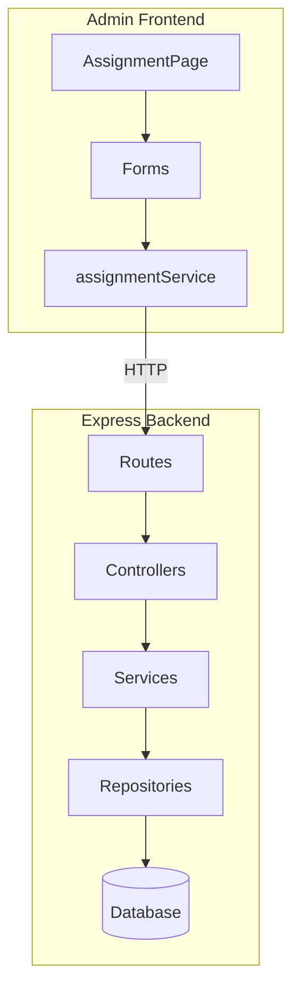
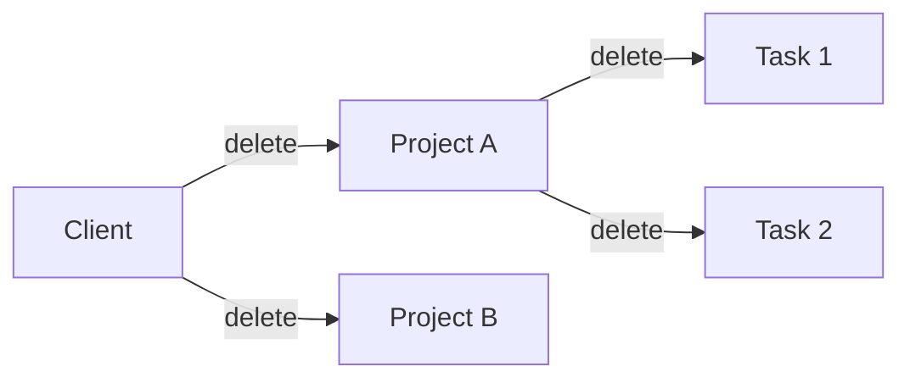

# Design — Add Assignment Entity CRUD

## Context

The Assignment Page currently has read-only display of clients, projects, and tasks. The database schema and RLS policies support full CRUD for admin users, but the frontend and backend lack full API connectivity. Admins need to manage the complete assignment hierarchy (client → project → task) directly from the UI without manual database access.

## Goals/Non-Goals

### Goals
- Enable full CRUD for Clients, Projects, and Tasks via the admin UI
- Implement cascade soft-delete (client → projects → tasks)
- Support i18n for all form labels
- Maintain data integrity through proper validation

### Non-Goals
- Hard delete of entities (data is always soft-deleted)
- Public API access (admin-only functionality)
- Bulk import/export operations
- Undo/restore UI (can be added later)

## Architecture Overview

This change follows the established layered architecture pattern already in use for Users CRUD:



## Decisions (with alternatives)

### 1. Cascade Soft-Delete Strategy

When deleting entities, we use cascade soft-delete to maintain referential integrity:



| Option | Description | Pros | Cons |
|--------|-------------|------|------|
| **A. Service-layer cascade (Selected)** | Services handle cascades in JS | Logging, future undo, notifications | No DB transaction guarantee |
| B. Database triggers | Postgres triggers cascade deletes | Atomic, consistent | Less visibility, harder to debug |
| C. Application-level with RPC | Supabase RPC function | Transactional | Additional DB schema changes |

**Choice**: **Option A** — Service-layer cascade provides better observability and flexibility for future features like undo and audit logging.

### 2. Dynamic Form Options

Forms require dynamic dropdown options (clients, projects, users). Two approaches considered:

| Approach | Pros | Cons |
|----------|------|------|
| **A. Pre-fetch all options on page load (Selected)** | Simple, single load | Stale data if edited elsewhere |
| B. Fetch options when form opens | Always fresh | Slight delay on form open |

**Choice**: **Approach A** — Pre-fetch on page load and refresh after mutations. The AssignmentPage already fetches all data on mount; we'll reuse this data for form dropdowns.

### 3. Form Configuration Pattern

| Option | Description | Pros | Cons |
|--------|-------------|------|------|
| A. Static exports | `export const createClientForm = {...}` | Simple | No i18n, no dynamic options |
| **B. Factory functions (Selected)** | `createClientForm = (t) => ({...})` | i18n, dynamic options | Slightly more complex |

**Choice**: Factory function pattern accepting dependencies:
```typescript
export const createClientForm = (t: TFunction) => ({
  title: t('forms.client.createTitle'),
  fields: getClientFields(t)
});
```

This enables i18n at render time and dynamic options injection.

## Risks/Trade-offs

| Risk | Impact | Mitigation |
|------|--------|------------|
| Partial cascade on service failure | Orphaned deactivated projects without deactivated client | Try-catch with logging; manual recovery possible via admin |
| Stale dropdown data | Users may select outdated options | Refresh data after mutations; forms use current state |
| No audit trail | Hard to trace who deleted what | Log cascade actions with timestamps; future audit table |
| Service-layer cascade not atomic | Data inconsistency window | Supabase lacks client-side transactions; accept risk for observability gains |

## Migration Plan

1. **Schema**: No schema changes required (existing tables support CRUD)
2. **Backend**:
   - Add validation schemas (`clientValidation.ts`, `projectValidation.ts`, `taskValidation.ts`)
   - Add CRUD methods to services
   - Add controller handlers and routes
3. **Frontend**:
   - Convert form configs to factory functions with i18n
   - Wire `AssignmentPage` handlers to new API calls
   - Add translations to `he.json` and `en.json`
4. **Testing**: Add unit tests for cascade behavior
5. **Rollout**: No feature flag needed (admin-only feature)
6. **Rollback**: Revert code changes; data remains intact (soft-delete only)

## Open Questions

| Question | Owner | Status |
|----------|-------|--------|
| Should cascade deletion send notifications? | Product | Deferred |
| Add "Restore" button for soft-deleted items? | UX | Implemented |
| Audit logging table design? | Backend | Future work |

## Error Handling

Following the existing pattern in `usersService.ts`:

| Error Type | HTTP Status | Code |
|------------|-------------|------|
| Validation Error | 400 | `VALIDATION_ERROR` |
| Not Found | 404 | `CLIENT_NOT_FOUND` / `PROJECT_NOT_FOUND` / `TASK_NOT_FOUND` |
| Foreign Key Violation | 400 | `INVALID_REFERENCE` |
| Authorization | 403 | `FORBIDDEN` |

## API Endpoint Design

Following REST conventions established by Users API:

| Operation | Method | Endpoint | Body |
|-----------|--------|----------|------|
| List clients | GET | `/api/v1/clients` | — |
| Create client | POST | `/api/v1/clients` | `{ name, contact_info? }` |
| Update client | PATCH | `/api/v1/clients/:id` | `{ name?, contact_info?, active? }` |
| Delete client | DELETE | `/api/v1/clients/:id` | — |

Same pattern applies to `/projects` and `/tasks`.

## Type Definitions

```typescript
// Shared types for create/update payloads
interface CreateClientPayload {
  name: string;
  contact_info?: string;
}

interface CreateProjectPayload {
  name: string;
  client_id: string;
  manager_user_id?: string;  // Optional
  start_date: string;
  end_date?: string;
  description?: string;
  time_format_type?: 'sum' | 'start_end';  // default: 'sum'
}

interface CreateTaskPayload {
  name: string;
  project_id: string;
  description?: string;
  end_date?: string;  // maps to due_date in form
}
```
